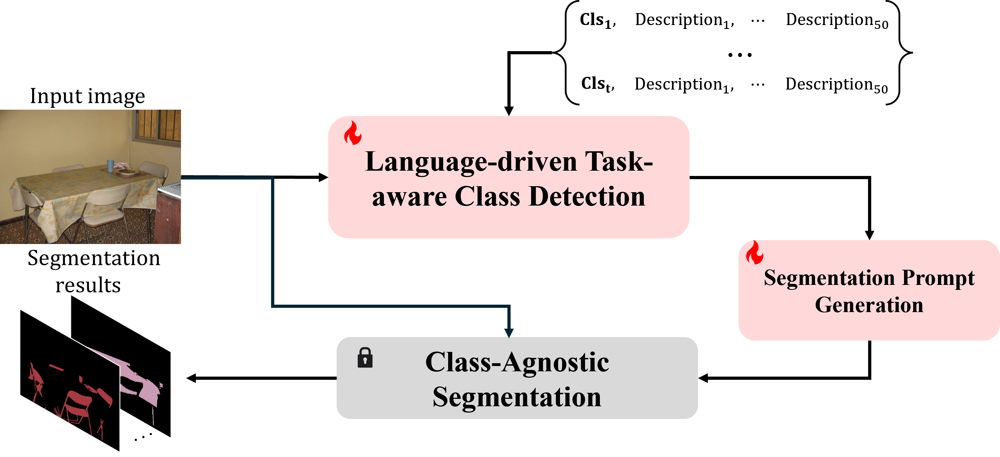
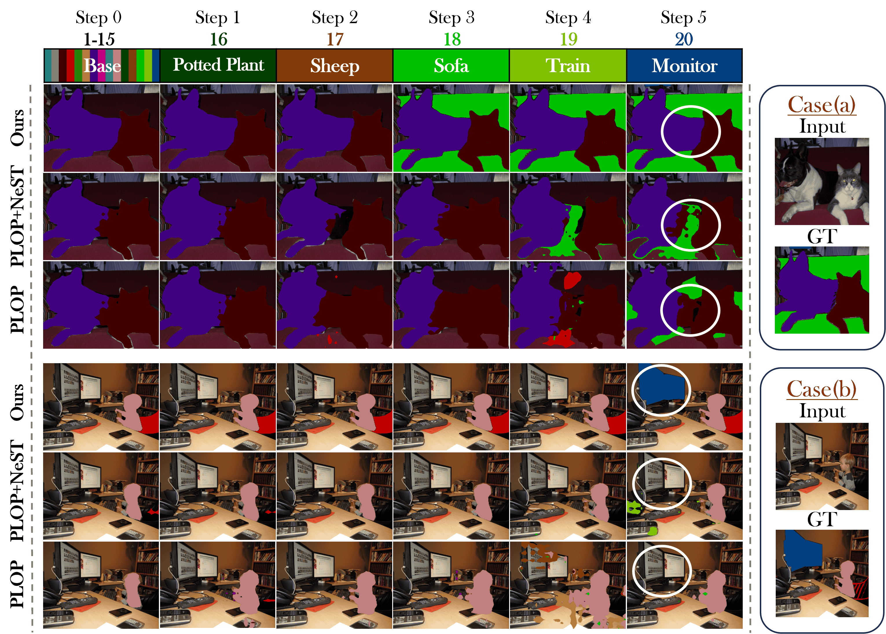
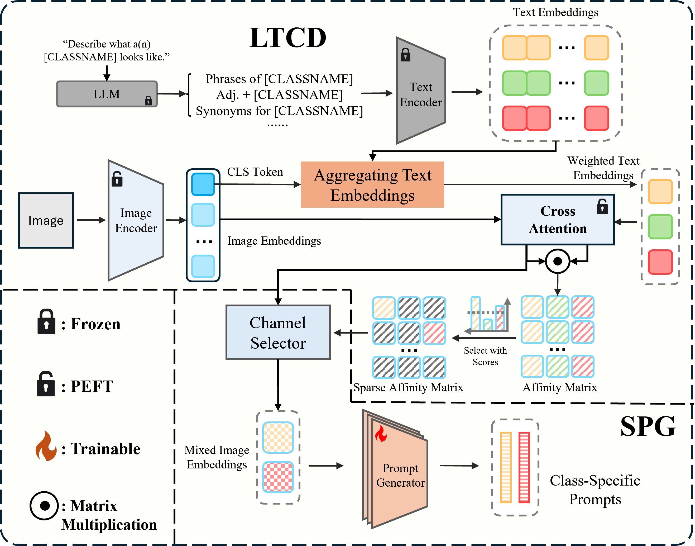

# DecoupleCSS: Decoupling Continual Semantic Segmentation

[](https://arxiv.org/pdf/2508.05065)
[](https://euyis1019.github.io/Decoupling-Continual-Semantic-Segmentation/)
[](https://github.com/euyis1019/Decoupling-Continual-Semantic-Segmentation)
> **Decoupling Continual Semantic Segmentation**  
> Yifu Guo*, Yuquan Lu*, Wentao Zhang, Zishan Xu, Dexia Chen, Siyu Zhang, Yizhe Zhang, Ruixuan Wang†  
> *Sun Yat-sen University, South China Normal University, Southwest University, Nanjing University of Science and Technology*

## 📝 Abstract

Continual Semantic Segmentation (CSS) requires learning new classes without forgetting previously acquired knowledge, addressing the fundamental challenge of catastrophic forgetting in dense prediction tasks. However, existing CSS methods typically employ single-stage encoder-decoder architectures where segmentation masks and class labels are tightly coupled, leading to interference between old and new class learning and suboptimal retention-plasticity balance. 

We introduce **DecoupleCSS**, a novel two-stage framework for CSS. By decoupling class-aware detection from class-agnostic segmentation, DecoupleCSS enables more effective continual learning, preserving past knowledge while learning new classes. The first stage leverages pre-trained text and image encoders, adapted using LoRA, to encode class-specific information and generate location-aware prompts. In the second stage, the Segment Anything Model (SAM) is employed to produce precise segmentation masks, ensuring that segmentation knowledge is shared across both new and previous classes.

## 🚀 Method Overview



Our approach consists of two main stages:

### Stage 1: Class-Aware Detection
- **Text-Image Fusion**: Leverages pre-trained text and image encoders to extract class-specific semantic information
- **LoRA Adaptation**: Adapts image encoders for new tasks using Low-Rank Adaptation while preserving old knowledge  
- **Prompt Generation**: Generates class-aware and location-specific prompts for segmentation

### Stage 2: Class-Agnostic Segmentation  
- **SAM Integration**: Employs Segment Anything Model to produce precise segmentation masks
- **Knowledge Sharing**: Segmentation knowledge is shared across both new and previous classes
- **Consistent Performance**: Maintains high segmentation quality for all classes

## 📊 Key Results


Our method achieves state-of-the-art performance across multiple challenging CSS benchmarks:

### Pascal VOC 2012
- **19-1 Setting**: Significant improvement over existing methods
- **15-5 Setting**: Consistent performance gains across all metrics
- **10-1 Setting**: Superior retention of old class knowledge
- **2-2 Setting**: Robust performance in challenging few-class incremental scenarios
- **4-2 Setting**: Effective handling of small incremental steps

### ADE20K
- **100-50 Setting**: Outstanding performance on complex multi-class scenarios
- **150-50 Setting**: Effective handling of large-scale incremental learning

### Qualitative Analysis



Our qualitative results demonstrate zero forgetting and excellent learning performance. The visualization clearly shows how our decoupled approach maintains knowledge of previous classes while effectively learning new ones across different continual learning steps.

### Key Performance Highlights
- **Better Retention**: Superior preservation of old class knowledge
- **Enhanced Plasticity**: Effective learning of new classes  
- **Balanced Performance**: Optimal trade-off between stability and adaptability
- **Challenging Settings**: Robust performance on difficult 2-2 and 4-2 incremental learning scenarios

## 🔧 Architecture Details



### Key Components:
1. **Pre-trained Text Encoder**: Processes class-specific textual information
2. **LoRA-adapted Image Encoder**: Efficiently adapts to new tasks while preserving old knowledge
3. **Prompt Generator**: Creates location-aware prompts for precise segmentation
4. **SAM Segmentator**: Generates high-quality masks using class-agnostic foundation model

## 🏆 Main Contributions

1. **Novel Framework**: First to explicitly decouple class-aware detection from class-agnostic segmentation in CSS
2. **Foundation Model Integration**: Pioneering use of SAM for continual semantic segmentation tasks
3. **Effective Knowledge Preservation**: Achieves superior balance between retention and plasticity
4. **State-of-the-Art Performance**: Demonstrates significant improvements across diverse CSS benchmarks

## 🎯 Applications

DecoupleCSS is particularly suited for:
- **Autonomous Driving**: Incremental learning of new road elements and traffic scenarios
- **Medical Imaging**: Progressive learning of new anatomical structures and pathologies  
- **Remote Sensing**: Continual adaptation to new geographical features and land use types

## 📄 Citation

If you find this work useful for your research, please cite:

```bibtex
@article{guo2024decoupling,
  title={Decoupling Continual Semantic Segmentation},
  author={Guo, Yifu and Lu, Yuquan and Zhang, Wentao and Xu, Zishan and Chen, Dexia and Zhang, Siyu and Zhang, Yizhe and Wang, Ruixuan},
  journal={arXiv preprint arXiv:XXXXX},
  year={2024}
}
```

## 📧 Contact

For questions and discussions, please contact:
- Yifu Guo: [1572189162@qq.com](mailto:1572189162@qq.com)
- Yuquan Lu: [20223801024@m.scnu.edu.cn](mailto:20223801024@m.scnu.edu.cn)

## 🔗 Links

- **Paper**: [https://arxiv.org/pdf/2508.05065](https://arxiv.org/pdf/2508.05065) 
- **Project Page**: [GitHub Pages](https://euyis1019.github.io/Decoupling-Continual-Semantic-Segmentation/)

## 📜 License

This project is licensed under the Apache License 2.0 - see the [LICENSE](LICENSE) file for details.

---

**Note**: The code will be made publicly available upon paper acceptance. 
